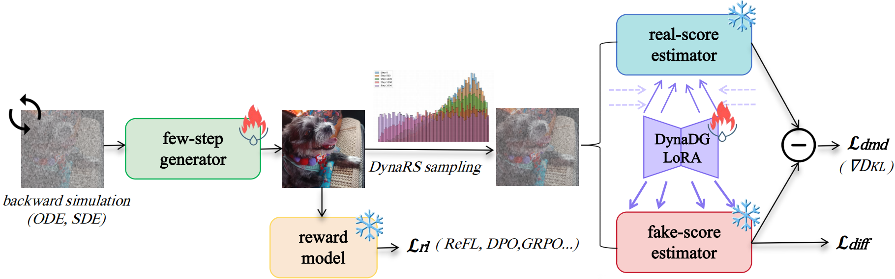

<h1 align="center"> DMDR:<br>Distribution Matching Distillation Meets  Reinforcement Learning</h1>
<div align="center">
  <a href='https://arxiv.org/abs/'></a>  &nbsp;
  <a href="https://github.com/vvvvvjdy/dmdr"></a> &nbsp; 
  <a href='https://huggingface.co/DyJiang/dmdr'></a> &nbsp;
</div>

---


<p align="center">
   <figcaption style="text-align: center; margin-top: 10px; font-size: 0.95em;">
            DMDR contains three key elements: (1). A DMD branch to optimize the generator using the gradient of an implicit distribution matching objective;  
            (2). A RL branch to synchronously introduce the reward feedback from the reward model;  
            (3). Two dynamic training strategies to achieve faster and better distillation in the initial phase.
        </figcaption>
  
</p>

---

## 💥 News

Our internal few-step model is on the verge of its unveiling and opensource. 
With ultra-realistic creation, native bilingual capabilities, exceptional text rendering, and so on. 
Stay tune for the model's release!

## 🔥 Update Plan and History

- **[xxxx]** We will release FSDP training scripts for DMDR.

- **[2025.11.18]** We have released the paper and code of DMDR! 


## 🛠️ Environment Setup
```bash
git clone https://github.com/vvvvvjdy/dmdr.git
conda create -n dmdr python=3.12 -y
conda activate dmdr
pip install -r requirements.txt
```


## 🌟 Inference
- **4 step SD3.5-Large generation**

```python
import torch
import matplotlib.pyplot as plt
from peft import PeftModel
from diffusers import StableDiffusion3Pipeline
base_path = "DyJiang/dmdr"
# dmdr with srpo
subfolder = "sd35l-dmdr-4step-srpo-dfnclip-hpsv21-lora"
# dmdr with refl
# subfolder = "sd35l-dmdr-4step-refl-dfnclip-hpsv21-lora"
device = "cuda" if torch.cuda.is_available() else "cpu"
pipe = StableDiffusion3Pipeline.from_pretrained(
    "stabilityai/stable-diffusion-3.5-large",
    torch_dtype=torch.float16
).to(device)
pipe.transformer = PeftModel.from_pretrained(pipe.transformer,
                                             base_path,
                                             subfolder = subfolder
                                              ).to(device=device, dtype=torch.float16)
pipe.scheduler.config['shift'] = 5
prompt = "A photorealistic tiny dragon taking a bath in a teacup, coherent, intricate"
with torch.no_grad():
    sample = pipe(
        prompt=prompt,
        guidance_scale=0,
        height=1024,
        width=1024,
        num_inference_steps=4,
    ).images[0]
plt.imshow(sample)
plt.axis('off')
plt.show()
sample.save("sd35l_dmdr_4step_example.png")
```


<p align="center">
   <figcaption style="text-align: center; margin-top: 10px; font-size: 0.95em;">
            Images generated by SD3.5 Large finetuned through DMDR with open-source data and reward model using  4 NFE.
        </figcaption>
  
</p>


- **1 step SDXL-Base generation**
```python
import torch
from diffusers import DiffusionPipeline, UNet2DConditionModel, LCMScheduler
from huggingface_hub import hf_hub_download
import matplotlib.pyplot as plt
base_model_id = "stabilityai/stable-diffusion-xl-base-1.0"
repo_name = "DyJiang/dmdr"
ckpt_name = "sdxl-dmdr-1step-odeinit-refl-dfnclip-hps21-unet/unet_sdxl_base_1.0_1step_res1024_fp32.bin"
device = torch.device("cuda" if torch.cuda.is_available() else "cpu")
# Load model.
unet = UNet2DConditionModel.from_config(base_model_id, subfolder="unet")
unet.load_state_dict(torch.load(hf_hub_download(repo_name, ckpt_name), map_location="cpu"))
pipe = DiffusionPipeline.from_pretrained(base_model_id, unet=unet, torch_dtype=torch.float16, variant="fp16").to(device=device, dtype=torch.float16)
pipe.scheduler = LCMScheduler.from_config(pipe.scheduler.config)
prompt = "A photo of cat"
with torch.no_grad():
    image=pipe(prompt=prompt, num_inference_steps=1, guidance_scale=0, timesteps=[399]).images[0]
plt.imshow(image)
plt.axis('off')
plt.show()
image.save("sdxl_1step_output.png")
```


## 🌠 Training 
### Note
- We use GPUs with 144GB memory each to train our few-step diffusion models, we do not encounter any OOM issues. If you use GPUs with smaller memory, you may need to (1) reduce the batch size, (2) train in different stage which we already support (3) use other more memory-saving distributed training methods such as FSDP, which we plan to support in the future. （4） add checkpointing for the reward model.
- As our machine is offline, we do not support logging tools such as Wandb currently. But you can easily add them in the training script.
- In our experiments, we find that stronger multi-step models and more appropriate reward models often bring better results in DMDR. Feel free to apply DMDR to your own multi-step models and reward models.

### Guidance

- Refer to [SD3 (t2i)](train_t2i/sd3/README.md) for training few-step SD3.5-L and SD3-M diffusion model.
- Refer to [SDXL (t2i)](train_t2i/sdxl/README.md) for training few-step SDXL-Base diffusion model.
- Refer to [SiT (class-conditional generation on ImageNet)](train_cc/sit/README.md) for training few-step SiT diffusion model.


## 🥂 Other Work of Our Team

- **[Decoupled DMD](https://)**: Rethinking how DMD works and  revealing a functional decoupling
strategy with CFG Augmentation (CA) as the primary engine for few-step conversion and Distribution
Matching (DM) as the regularizer. 


## 🤝🏻 Acknowledgement

This code is mainly built upon [DMD2](https://github.com/tianweiy/DMD2), [Flow-GRPO](https://github.com/yifan123/flow_grpo), [SRA](https://github.com/vvvvvjdy/SRA),  [ReFL](https://github.com/zai-org/ImageReward), [SRPO](https://github.com/Tencent-Hunyuan/SRPO) repositories. 
Thanks for  their contributions to the community.

We also sincerely thank the opensource weights from [SDXL](https://huggingface.co/stabilityai/stable-diffusion-xl-base-1.0), [SD3](https://huggingface.co/stabilityai/stable-diffusion-3-medium), [SD3.5](https://huggingface.co/stabilityai/stable-diffusion-3.5-large), 
[DFN-CLIP](https://huggingface.co/apple/DFN5B-CLIP-ViT-H-14), [HPSv2.1](https://huggingface.co/xswu/HPSv2), [REPA](https://github.com/sihyun-yu/REPA), [DINOv2](https://github.com/facebookresearch/dinov2) and so on. We also thank the opensource data from [t2i-2M](https://huggingface.co/datasets/jackyhate/text-to-image-2M). 
We only use these weights and data for research purpose.


## 🌺 Citation
If you find DMDR useful, please kindly cite our paper:
```bibtex
@article{jiang2025dmdr,
title={Distribution Matching Distillation Meets Reinforcement Learning},
author={Jiang, Dengyang and Liu, Dongyang and Wang, Zanyi and Wu, Qilong and Jin, Xin and Liu, David and Li, Zhen and Wang, Mengmeng and Gao, Peng and Yang, Harry},
journal={arXiv preprint arXiv:2505.02831},
year={2025}
}
```
